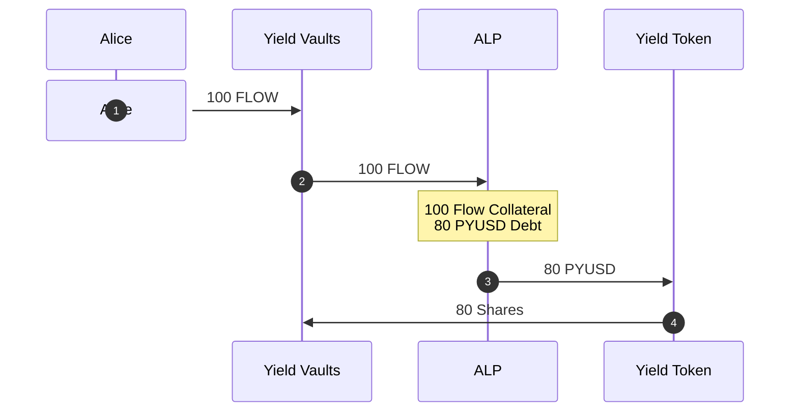
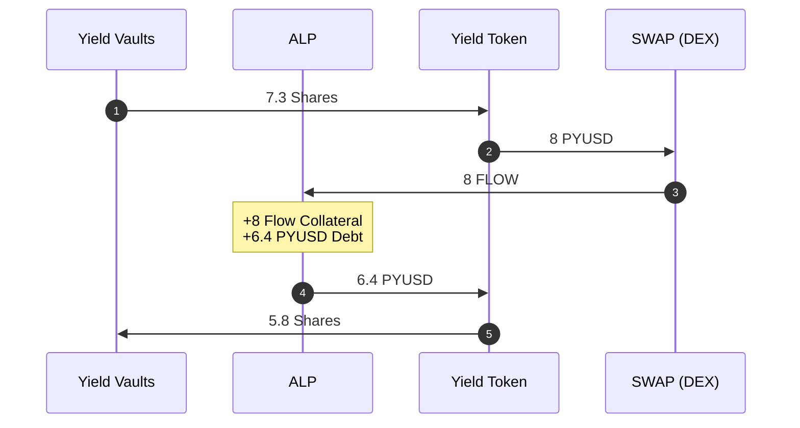
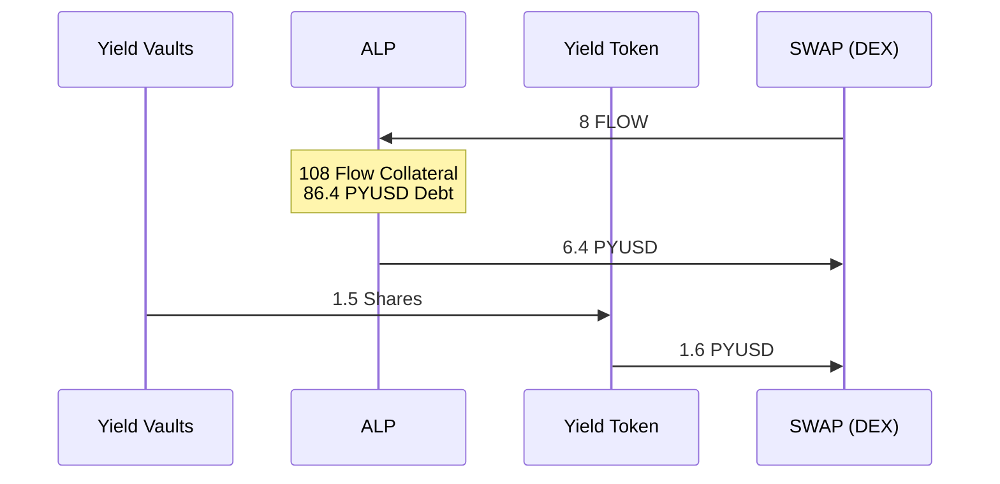

Initial shit

```mermaid
sequenceDiagram
    autonumber
    participant Alice
    participant YV as Yield Vaults
    participant ALP as ALP
    participant ERC as Yield Token

    destroy Alice
    Alice->>YV: 100 FLOW
    YV->>ALP: 100 FLOW
    %% ALP->>YV: 80 PYUSD
    Note over ALP: 100 Flow Collateral<br>80 PYUSD Debt
    %% YV->>ERC: 80 PYUSD
    ALP->>ERC: 80 PYUSD
    ERC->>YV: 80 Shares
```

Shares increase to 2$

```mermaid
sequenceDiagram
    autonumber
    participant YV as Yield Vaults
    participant ALP as ALP
    participant ERC as Yield Token
    participant SW as SWAP (DEX)

    YV->>ERC: 7.3 Shares
    ERC->>SW: 8 PYUSD
    SW->>ALP: 8 FLOW
    Note over ALP: +8 Flow Collateral<br>+6.4 PYUSD Debt
    ALP->>ERC: 6.4 PYUSD
    ERC->>YV: 5.8 Shares
```

```mermaid
sequenceDiagram
    participant YV as Yield Vaults
    participant ALP as ALP
    participant ERC as Yield Token
    participant SW as SWAP (DEX)

    SW->>ALP: 8 FLOW
    Note over ALP: 108 Flow Collateral<br>86.4 PYUSD Debt
    ALP->>SW: 6.4 PYUSD
    YV->>ERC: 1.5 Shares
    ERC->>SW: 1.6 PYUSD
```